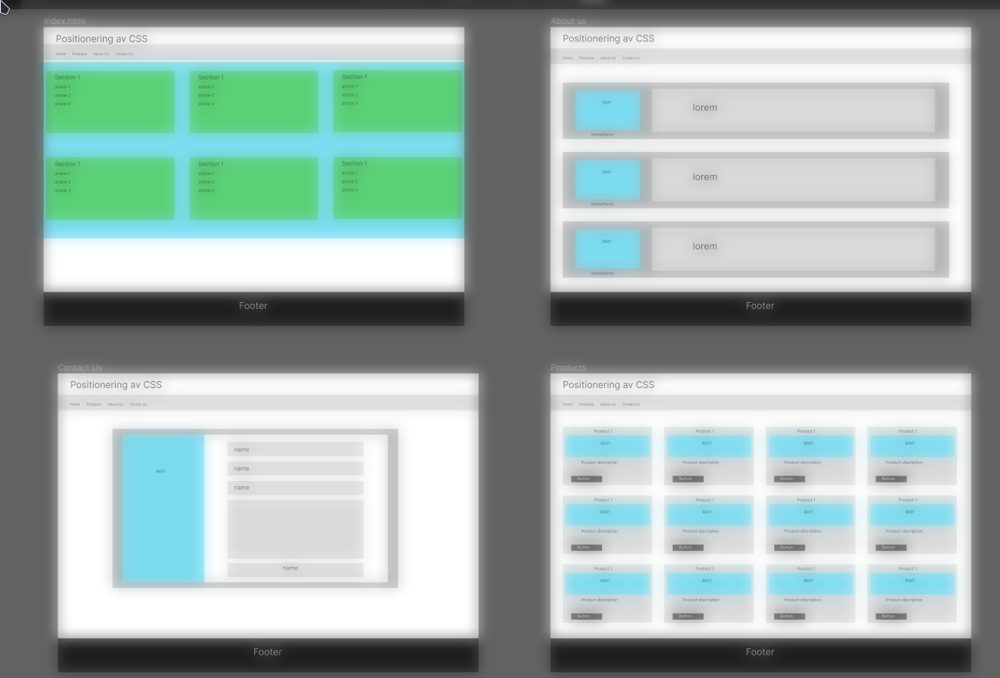

# Project Title

CSS-positioning
A website for learning about how html and css can work together

# Wireframe made in figma
[][commitUrl]

[commitUrl]: https://www.figma.com/file/CzwbTeg6dQtz5RT4D2yuKt/Uppgift-3-CSS-positioning?node-id=0%3A1
## Authors

- [@PeterRyden2546](https://www.github.com/PeterRyden2546)
- [@JoanAndersson](https://www.github.com/JoanAndersson)
- [@andresparrab](https://www.github.com/andresparrab)

## Tech Stack

**Client:** HTML, CSS

